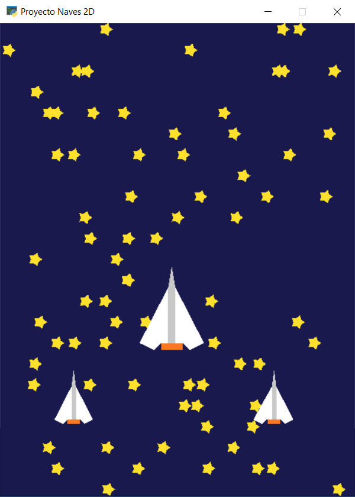

# CC3501-Computacion-grafica
Repositorio de mis proyectos personales en Python para el curso CC3501 "Modelación y Computación Gráfica para Ingenieros".

Para ejecutar los archivos de este repositorio es necesario tener instalada la librería <a href="https://pyglet.org/" target="_blank" rel="noreferrer"> <code>Pyglet</code> </a>.

## Naves_2D.py
Naves_2D.py es un programa que al ejecutarse abre una ventana como la que se muestra a continuación:

Todas las figuras visibles dentro de la ventana se fueron hechas utilizando <code>pyglet.shapes</code>. Para 
generar el efecto de movimiento en las naves se hizo que las estrellas del fondo fueran cayendo. El programa está siempre creando estrellas nuevas
y una vez que estas se salen de la pantalla, son eliminadas.

## Naves_Bezier.py
Descripción próximamente.

Su uso requiere de los archivos <code>resources.py</code> y <code>shader.py</code> que se encuentran en este repositorio.

## Lluvia.py
Descripción próximamente.

Su uso requiere el archivo <code>Lluvia_Shader.py</code> que se encuentra en este repositorio.
