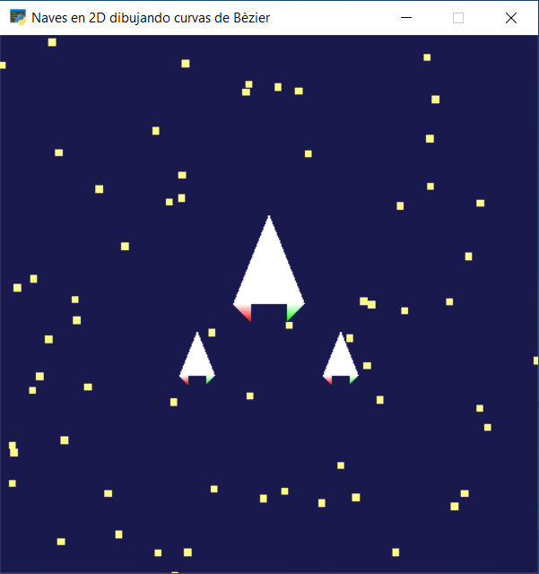
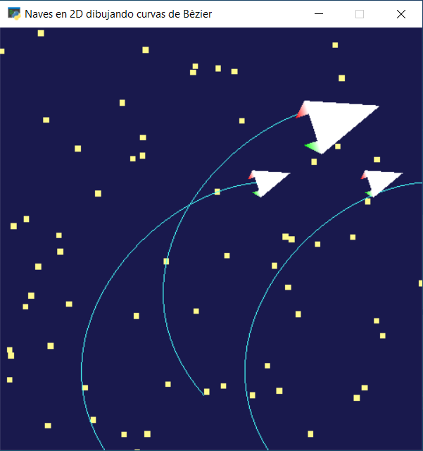
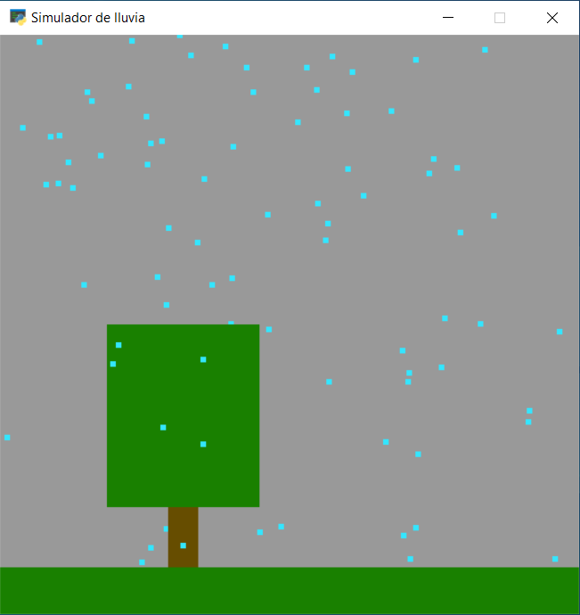
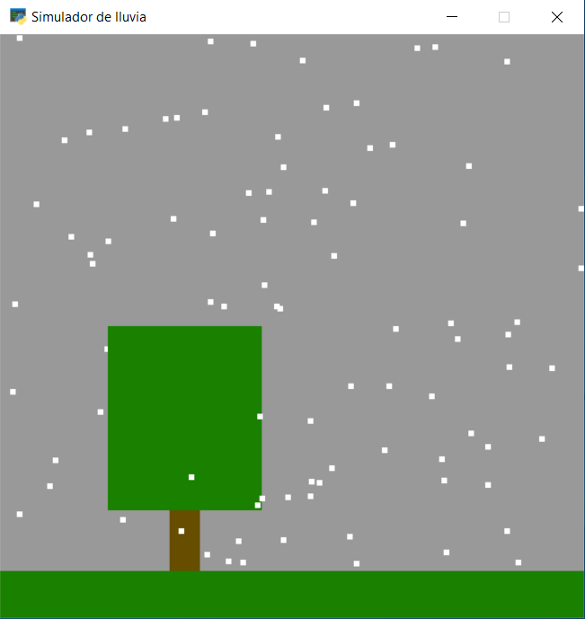

# CC3501-Computacion-grafica
Repositorio de mis proyectos personales en Python para el curso CC3501 "Modelación y Computación Gráfica para Ingenieros".

Para ejecutar los archivos de este repositorio es necesario tener instalada la librería <a href="https://pyglet.org/" target="_blank" rel="noreferrer"> <code>Pyglet</code> </a>.

## Naves_2D.py
<code>Naves_2D.py</code> es un programa que al ejecutarse abre una ventana como la que se muestra a continuación:

Todas las figuras visibles dentro de la ventana se fueron hechas utilizando <code>pyglet.shapes</code>. Para 
generar el efecto de movimiento en las naves se hizo que las estrellas del fondo fueran cayendo. El programa está siempre creando estrellas nuevas
y una vez que estas se salen de la pantalla, son eliminadas.

## Naves_Bezier.py
<code>Naves_Bezier.py</code> es un programa que al ejecutarse abre una ventana como la que se muestra a continuación:

Su uso requiere de los archivos <code>resources.py</code> y <code>shader.py</code> que se encuentran en este repositorio.
En <code>resources.py</code> se encuentran las figuras de las naves, la función de actualización de las mismas y las estrellas del fondo.
En <code>shader.py</code> se encuentra el shader program que <code>pyglet.shapes</code> utilizará para dibujar.

Las naves se mueven con W,A,S,D. Al presionar la tecla R se guardan las posiciones de las naves en listas que contienen
los puntos de control de las curvas de Bèzier. Con la tecla V se grafican las curvas utilizando <code>pyglet.shapes.BezierCurve</code>.
El resultado es el siguiente:

Hay una desviación en la curva dibujada, esta se debe a un problema de conversión de espacios cartesianos. Sin embargo, la aproximación es aceptable.

## Lluvia.py
<code>Lluvia.py</code> es un programa que abre una ventana en la que se muestra "lluvia".

Su uso requiere el archivo <code>Lluvia_Shader.py</code> que se encuentra en este repositorio.

El programa utiliza un sistema de partículas para simular la lluvia. Estas particulas están constantemente cayendo, por lo que una vez que llegan al suelo se
devuelven arriba con una posición aleatoria en los ejes x,z. Por otro lado, el entorno dibujado se encuentra en 3D y se ve con una proyección en perspectiva.

El tamaño base de las partículas es 5. 
* La tecla L las vuelve más pequeñas, dejándolas de tamaño 3.
* La tecla H agranda las partículas, que quedan de tamaño 7.
* La tecla N devuelve las partículas al tamaño inicial (5).

La tecla S cambia el color de las partículas, estas se vuelven blancas y disminuyen su velocidad, lo que simularía nieve. Volver a presionar S las devuelve al estilo "agua".

